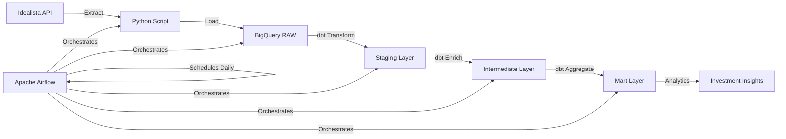

# 🏠 Madrid Real Estate Investment Analytics Pipeline

[](https://www.python.org/)
[](https://www.getdbt.com/)
[](https://airflow.apache.org/)
[](https://cloud.google.com/bigquery)
[](LICENSE)

> **Data-Driven Real Estate Investment Analysis for Southern Madrid**  
> Identify undervalued properties and investment opportunities using advanced SQL analytics and market comparison metrics

## 📊 Overview

This project implements a production-ready data pipeline that analyzes 1,000+ real estate properties daily from Madrid's southern districts. By comparing individual properties against zone averages and market metrics, it automatically identifies investment opportunities.

### 🎯 Key Analytics Features

- **Zone Analysis**: Compare properties against neighborhood averages (price, size, features)
- **Opportunity Detection**: Classify properties as "Opportunity", "Market", or "Overvalued"
- **Competitiveness Index**: Score properties based on features vs. price ratio
- **Price Deviation Metrics**: Calculate % deviation from zone and property type averages
- **Premium Features Tracking**: Monitor distribution of parking, pools, terraces, gardens, A/C

### 📈 Real Results

From analyzing **1,136 properties** in Southern Madrid:
- Properties below 80% zone average with 2+ premium features → **"Opportunity"**
- Properties above 120% zone average → **"Overvalued"**
- Average price/m²: Calculated by zone for accurate comparisons
- Premium feature distribution: Tracked for investment insights

## 🏗️ Architecture



### Tech Stack

- **Orchestration**: Apache Airflow 3.1 (PythonOperator for macOS ARM64 compatibility)
- **Data Warehouse**: Google BigQuery
  - `raw_data`: Raw property listings
  - `dbt_staging`: Cleaned and validated data
  - `dbt_intermediate`: Enriched with zone metrics and KPIs
  - `dbt_mart`: Final analytics layer
- **Transformation**: dbt 1.10 with SQL-based analytics
- **Data Quality**: 7 automated tests ensuring data reliability
- **API**: RapidAPI Idealista integration

## 📁 Project Structure

```
idealista-analytics-pipeline/
├── airflow/
│   ├── dags/
│   │   └── idealista_analytics_pipeline.py  # Main orchestration DAG
│   └── logs/                                 # Execution logs
├── dbt/
│   ├── models/
│   │   ├── base/                            # Raw data views
│   │   ├── staging/                         # Cleaned & validated
│   │   ├── intermediate/                    # Enriched with KPIs
│   │   └── mart/                           # Final analytics
│   └── tests/                              # Data quality tests
├── scripts/
│   ├── api_client/
│   │   └── idealista.py                    # API extraction script
│   └── run_pipeline.sh                     # Manual execution helper
├── docs/                                    # Documentation
├── .env.example                            # Environment variables template
├── requirements.txt                         # Python dependencies
└── README.md                               # This file
```

## 🚀 Quick Start

### Prerequisites

- Python 3.9+ (3.12 recommended)
- Google Cloud account with BigQuery enabled
- RapidAPI account with Idealista API access
- macOS/Linux (Windows users: use WSL2)

### Option 1: Automated Setup (Recommended)

1. **Clone the repository**
   ```bash
   git clone https://github.com/yourusername/idealista-analytics-pipeline.git
   cd idealista-analytics-pipeline
   ```

2. **Run the setup script**
   ```bash
   chmod +x setup.sh
   ./setup.sh
   ```
   
   This script will:
   - Create a Python virtual environment
   - Install all dependencies
   - Create necessary directories
   - Set up configuration files
   - Initialize Airflow

3. **Configure your credentials**
   ```bash
   # Edit .env with your BigQuery and API credentials
   nano .env
   
   # Edit dbt profile with your BigQuery details
   nano ~/.dbt/profiles.yml
   ```

4. **Set up BigQuery datasets**
   
   Follow the detailed guide in [docs/bigquery_setup.md](docs/bigquery_setup.md)

### Option 2: Manual Setup

1. **Clone the repository**
   ```bash
   git clone https://github.com/yourusername/idealista-analytics-pipeline.git
   cd idealista-analytics-pipeline
   ```

2. **Set up Python environment**
   ```bash
   python3 -m venv .venv
   source .venv/bin/activate  # On Windows: .venv\Scripts\activate
   pip install -r requirements.txt
   ```

3. **Configure environment variables**
   ```bash
   cp .env.example .env
   # Edit .env with your credentials
   ```

4. **Configure dbt**
   ```bash
   mkdir -p ~/.dbt
   cp dbt/profiles.yml.example ~/.dbt/profiles.yml
   # Edit ~/.dbt/profiles.yml with your BigQuery details
   ```

5. **Initialize Airflow**
   ```bash
   export AIRFLOW_HOME=$(pwd)/airflow
   airflow db migrate
   ```

### Using Make Commands

This project includes a Makefile for common operations:

```bash
# Setup environment
make setup

# Run complete pipeline
make run

# Run only extraction
make extract

# Run dbt models
make dbt

# Run tests
make test

# Start Airflow UI
make airflow

# Clean temporary files
make clean
```

## 💻 Usage

### Option 1: Run Complete Pipeline (Recommended)

```bash
# Execute the entire pipeline
./scripts/run_pipeline.sh
```

This script handles the complete workflow:
1. Extracts latest property data from Idealista
2. Loads to BigQuery raw layer
3. Runs all dbt transformations
4. Executes data quality tests

### Option 2: Run via Airflow UI

```bash
# Start Airflow
airflow standalone

# Access UI at http://localhost:8080
# Trigger the 'idealista_analytics_pipeline' DAG
```

⚠️ **Note for macOS Users**: Due to Apple Silicon compatibility issues, you may encounter SIGSEGV errors when running from the UI. Use `./scripts/run_pipeline.sh` for reliable execution.

### Option 3: Run Components Individually

```bash
# Extract data only
python scripts/api_client/idealista.py

# Run dbt transformations
cd dbt
dbt run

# Run data quality tests
dbt test
```

## 📊 Data Model

### Key Metrics Calculated

| Metric | Description | Use Case |
|--------|-------------|----------|
| `price_deviation_zone_pct` | % difference from zone average price | Find undervalued properties |
| `competitiveness_index` | Features-to-price ratio vs. zone | Identify best value deals |
| `opportunity_classification` | Automatic categorization | Quick filtering |
| `premium_features_count` | Total premium amenities (0-5) | Quality assessment |
| `price_m2_deviation_zone_pct` | % difference in €/m² from zone | Size-adjusted comparison |

### Final Analytics Table: `mart.madrid_south_real_estate_metrics`

Contains 80+ columns including:
- Property details (price, size, rooms, features)
- Zone metrics (averages, medians, distributions)
- Property type comparisons
- Calculated KPIs and classifications

## 🧪 Data Quality

Automated tests ensure reliability:
- ✅ Primary key uniqueness
- ✅ Not-null validations on critical fields
- ✅ Price reasonability checks
- ✅ Geographic coordinate validation
- ✅ Data freshness monitoring

Run tests with:
```bash
cd dbt
dbt test
```

## 🔧 Troubleshooting

### macOS Apple Silicon Issues

If you encounter architecture-related errors:
1. The DAG uses `PythonOperator` instead of `BashOperator` to avoid conflicts
2. Use `./scripts/run_pipeline.sh` for manual execution
3. Set environment variables:
   ```bash
   export no_proxy="*"
   export PYTHONFAULTHANDLER=true
   ```

### BigQuery Authentication

```bash
# Verify authentication
gcloud auth application-default print-access-token

# Set default project
gcloud config set project YOUR_PROJECT_ID
```

## 📈 Sample Insights

From our analysis of Southern Madrid properties:

```sql
-- Find investment opportunities
SELECT 
    property_code,
    address,
    price,
    price_deviation_zone_pct,
    premium_features_count,
    opportunity_classification
FROM `project.dbt_mart.madrid_south_real_estate_metrics`
WHERE opportunity_classification = 'Opportunity'
ORDER BY competitiveness_index DESC
LIMIT 10;
```

## 🤝 Contributing

Contributions are welcome! Please feel free to submit a Pull Request.

1. Fork the repository
2. Create your feature branch (`git checkout -b feature/AmazingFeature`)
3. Commit your changes (`git commit -m 'Add some AmazingFeature'`)
4. Push to the branch (`git push origin feature/AmazingFeature`)
5. Open a Pull Request

## 📝 License

This project is licensed under the MIT License - see the [LICENSE](LICENSE) file for details.

## 👨‍💻 Author

**Mikel**
- LinkedIn: [Mikel-LinkedIn](https://www.linkedin.com/in/mikel-garcia-prats-080920/)
- GitHub: [Mikel0809](https://github.com/Mikel0809)

## 🙏 Acknowledgments

- Idealista API for real estate data
- dbt Labs for the transformation framework
- Apache Airflow for orchestration
- Google BigQuery for data warehousing